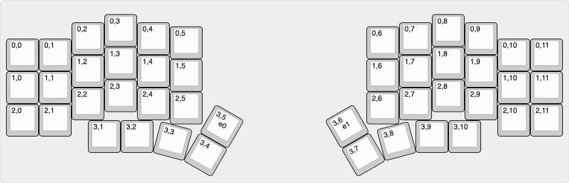
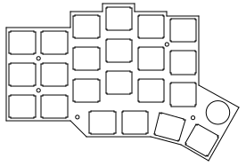
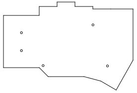
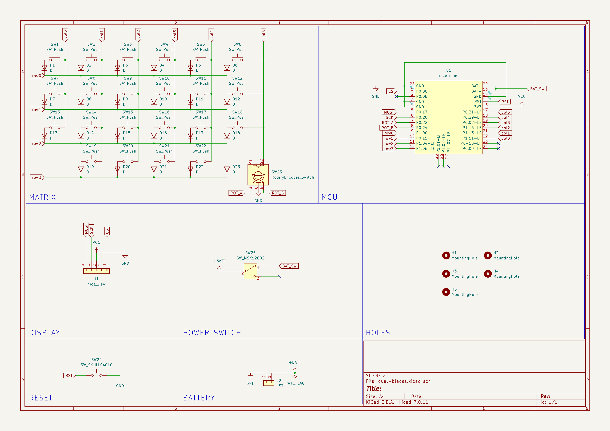
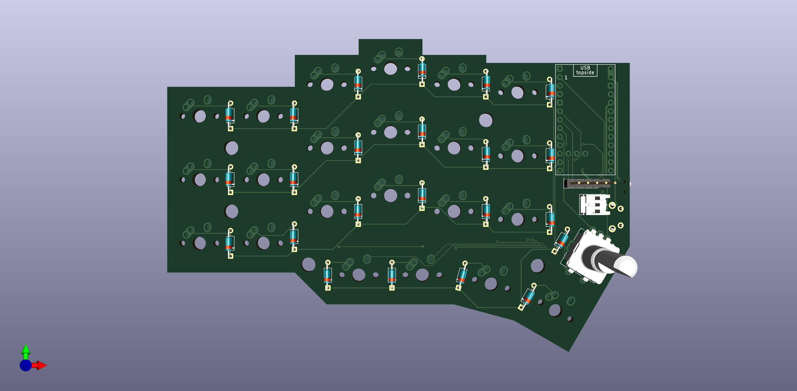
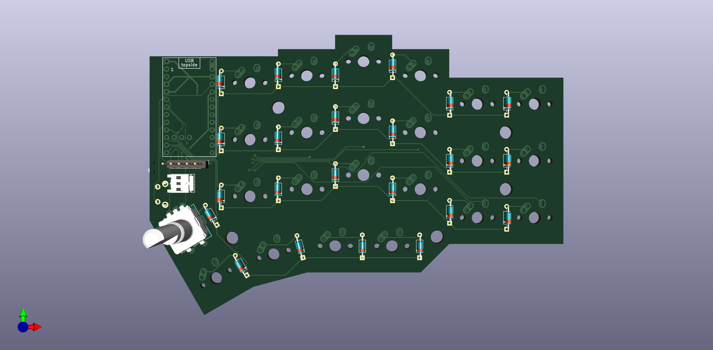
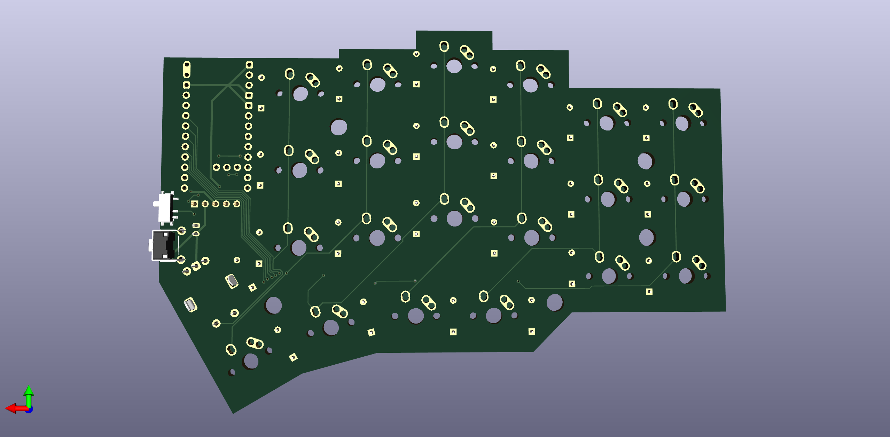
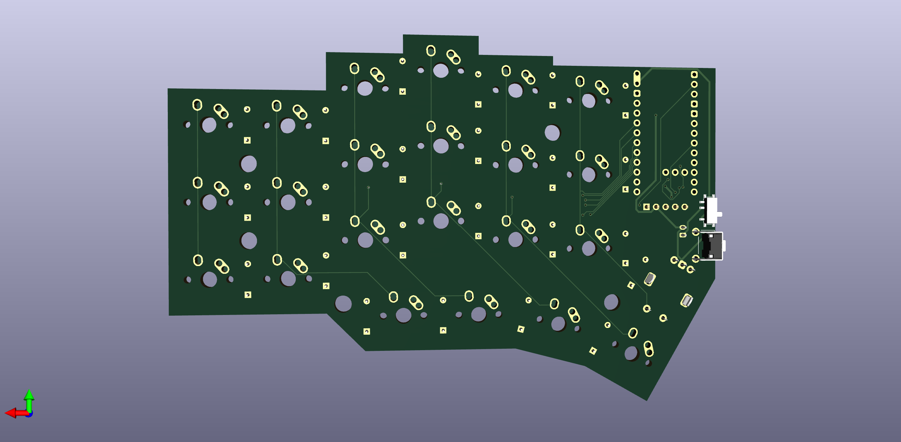

# Dual Blades

## Images
### Keyboard Layout

### Plates

### PCB

  
  

  
  

## Features
* Split, wireless
* ZMK firmware
* nice!nano mcu
* nice!view display
* rotary encoders
* Column-staggered 44 key layout (inspired by the [Void Ergo S](https://github.com/victorlucachi/void_ergo))
* Switch-agnostic - hybrid MX/Alps PCB footprints + combo plate cutout
* Floating PCB plate
* LiPo batteries

## Firmware
[ZMK Keyboard Dual Blades](https://github.com/pakleni/zmk-keyboard-dual-blades)

## Bill of Materials

| Qty | Part |
|----:|------|
| 1 | [Matias Click Switch (box of 200)](https://matias.store/products/matias-click-switch-box-of-200) |
| 1 | [Keycap set - black blank Planck](https://matias.store/products/keycap-set-black-blank-planck) |
| 2 | [Encoder knobs](https://splitkb.com/products/knurled-metal-encoder-knob) |
| 2 | [nice!view](https://splitkb.com/products/nice-view) |
| 2 | [nice!nano](https://splitkb.com/products/nice-nano) |
| 1 | [Wireless Controller Expansion Bundle](https://splitkb.com/products/wireless-controller-expansion-bundle) |
| 1 | [THT 1N4148 diodes (100 pcs)](https://splitkb.com/products/tht-diodes) |
| 1 | [Linear rotary encoder](https://splitkb.com/products/linear-rotary-encoder) |
| 1 | [Tactile rotary encoder](https://splitkb.com/products/industrial-rotary-encoder) |
| 1 | [Reset buttons - **side push** (set of two)](https://splitkb.com/products/reset-buttons) |
| 2 | [Mill-Max Low Profile Sockets](https://splitkb.com/products/mill-max-low-profile-sockets) |
| 1 | [M2 screws - **4 mm**(set of 50)](https://splitkb.com/products/m2-screws) |
| 1 | [Brass M2 spacers - **8 mm** (set of 50)](https://splitkb.com/products/brass-m2-spacers) |
| 2 | [301230 LiPo](https://www.aliexpress.com/item/1005005348368664.html) |

## Used
* http://www.keyboard-layout-editor.com
* http://builder.swillkb.com
* https://librecad.org
* https://www.kicad.org

This work is licensed under a [Creative Commons Attribution-NonCommercial-ShareAlike 4.0 International License](https://creativecommons.org/licenses/by-nc-sa/4.0/).
